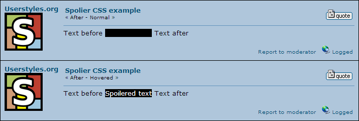

# BLF Spoilers

Unhide transparent text (and `[abbr]`) by hovering over it.

## Changelog

1.0.0:
- Converted to a [Stylus](http://stylus-lang.com/)-based user style for the [Stylus extension](http://add0n.com/stylus.html).
- Changed "non-revealed" color to `transparent` to allow background transparency

### Userstyles.org

- Removed blur CSS, added option to reveal `[abbr]` and `[acronym]` (a la Reddit custom CSS)

## License

  
This work is licensed under a [Creative Commons Attribution 4.0 International License](http://creativecommons.org/licenses/by/4.0/).

