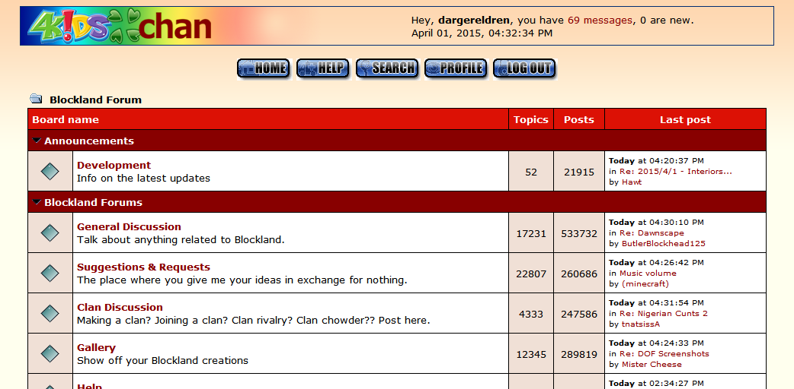

# Blockland Forum - 4Kidschan

BLF April Fools 2015 theme.

Custom logos (and Yotsuba B edit) made by myself. Everything else is from the original CSS.

https://forum.blockland.us/Themes/4Kids/style.css

## Changelog

1.0.1: Added homepage URL

1.0.0: Converted to a [Stylus](http://stylus-lang.com/)-based user style for the [Stylus extension](http://add0n.com/stylus.html).
