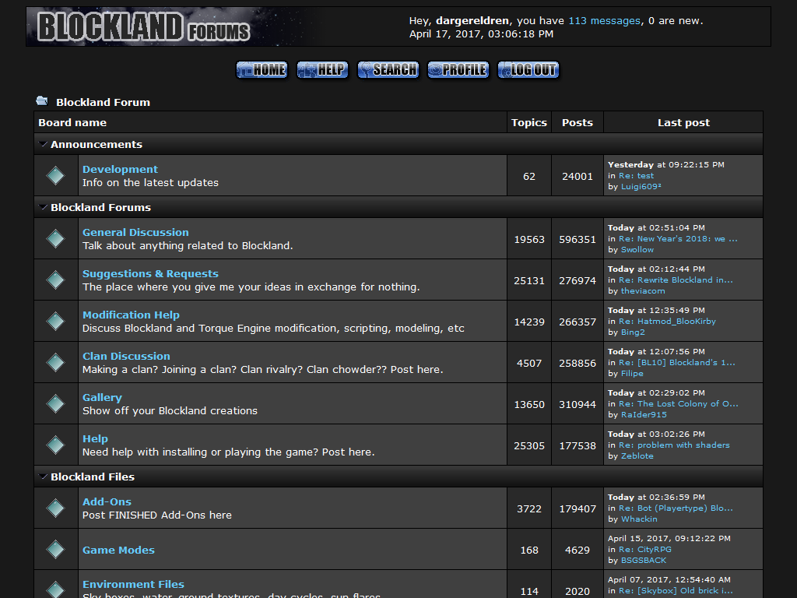

# Blockland Forum - Dark Theme

A derivative of my old BLF "Metro" theme.

The modified BLF logo is by [Master Matthew](https://forum.blockland.us/index.php?topic=309244.msg9505084#msg9505084).  
Inspired by (and some code borrowed from) Blockland Steam by [Kingdaro](https://userstyles.org/users/127715) (CC BY)

## Changelog

1.1.1: Added [dark post buttons](https://forum.blockland.us/index.php?topic=309598.msg9520292#msg9520292)

1.1.0: Converted to a user style for the [Stylus extension](http://add0n.com/stylus.html).

### Userstyles.org

1.04: some white in the category header gradient, and blue links (red on hover)

1.03: fixed: two "Home" nav buttons

1.02: darker category and title headers, also search highlighting

1.01: changed the logo cause master matthew made a better one right when i released this

## License

  
This work is licensed under a [Creative Commons Attribution-ShareAlike 4.0 International License](http://creativecommons.org/licenses/by-sa/4.0/).