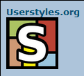

# Blockland Forum - Large Avatars

**Before:**  

Allows viewing .ico avatars bigger than 75x75 without scaling down.

In other words, breaks the fix that forces avatars' widths to be 75.

Please note that in the preview images, the Blockland forum user "Userstyles.org" does not actually exist, and if it did, it's purely just a coincidence.
I just used that name as an example.

## Changelog

1.0.0: Converted to a [Stylus](http://stylus-lang.com/)-based user style for the [Stylus extension](http://add0n.com/stylus.html).

## License

  
This work is licensed under a [Creative Commons Attribution 4.0 International License](http://creativecommons.org/licenses/by/4.0/).
