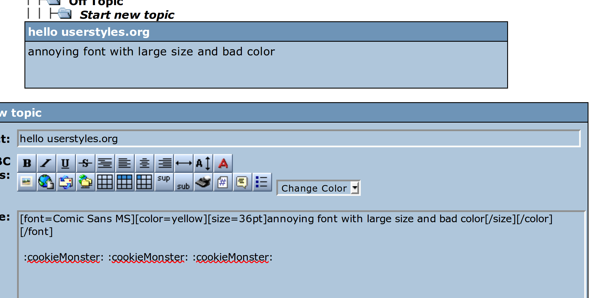

# Blockland Forum - No emotes / obnoxious formatting

For those that hate fun. Disables emotes (from BLF, garycact.us, and Steam), `[color]`, `[font]`, and `[size]`.

## Changelog:

1.0.1: Added homepage URL

1.0.0: Converted to a [Stylus](http://stylus-lang.com/)-based user style for the [Stylus extension](http://add0n.com/stylus.html).

### Userstyles.org:

- Modified steam emote check to more broadly search for images that contain "/economy/emoticon/" in the URL - may break some images as a side effect.

## License

  
This work is licensed under a [Creative Commons Attribution 4.0 International License](http://creativecommons.org/licenses/by/4.0/).
