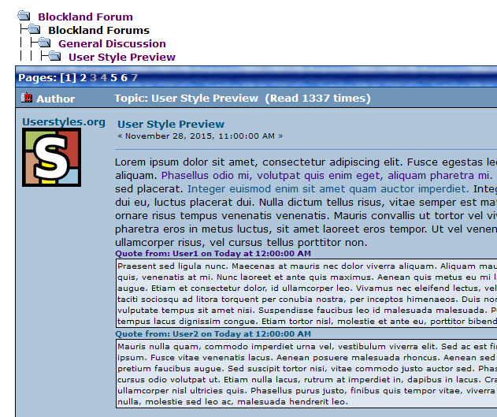

# Blockland Forum - Purple Visited Links

Changes the color of visited links to see if you have already clicked the link before.

May not work with private browsing, since your browsing history is not tracked.

## Changelog:

1.0.0: Converted to a [Stylus](http://stylus-lang.com/)-based user style for the [Stylus extension](http://add0n.com/stylus.html).

## License

  
This work is licensed under a [Creative Commons Attribution 4.0 International License](http://creativecommons.org/licenses/by/4.0/).
