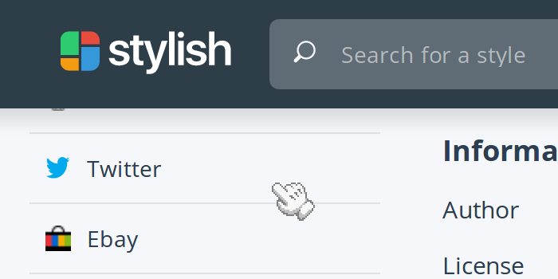

# Mario Paint (global cursor)

/mario-paint-cursor.user.styl)

The Mario Paint title screen cursor, as a global cursor.
Mario Paint™ is copyright ©1992 Nintendo

## Changelog:

1.0.0: Converted to a [Stylus](http://stylus-lang.com/)-based user style for the [Stylus extension](http://add0n.com/stylus.html).

### Userstyles.org:

- Optimized cursor images