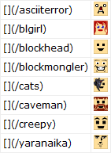
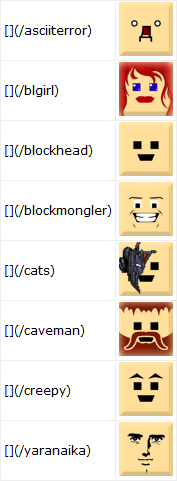

# Reddit - Blockland (Steam) Emotes

%20Emotes/Reddit%20-%20Blockland%20(Steam)%20Emotes/reddit-blockland-steam-emotes.user.styl)

**Large emotes:**:

Blockland's official Steam emotes, converted to Reddit emotes for use on /r/Blockland.

This style uses the f7u12 / mylittlepony emote format: ``

Note that it will apply to all subreddits starting with "Blockland", including /r/Blockland itself, and emote names are case-sensitive (all lowercase)

## Changelog

1.0.0: 
- Converted to a [Stylus](http://stylus-lang.com/)-based user style for the [Stylus extension](http://add0n.com/stylus.html).
- Removed the "All of Reddit" option

### Userstyles.org

- Converted the dead Imgur links to base64